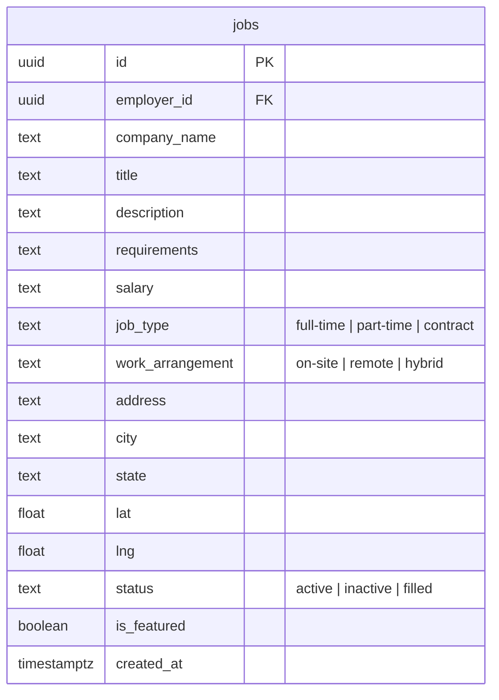

# feat: Split job type and work arrangement into separate fields

## Overview

Split the single `job_type` column into two separate concepts — **job type** (employment type: full-time, part-time, contract) and **work arrangement** (location flexibility: on-site, remote, hybrid). Simplify the homepage search bar from 4 filter fields to 3 by showing only the work arrangement filter. The MapPage retains full filtering with both dropdowns plus categories.

## Problem Statement / Motivation

- The homepage search bar is cramped with 4 filter fields — Jess noted the categories dropdown was getting cut off on smaller screens
- The current `job_type` field mixes two different concepts (employment type vs. location flexibility), which doesn't match industry standards (ZipRecruiter, Indeed separate these)
- Job seekers most commonly filter by work arrangement first (remote/hybrid/on-site), so that should be the homepage-level filter
- Deeper filtering (employment type, categories) belongs on the MapPage's full search experience

(see brainstorm: `docs/brainstorms/2026-03-28-search-restructure-brainstorm.md`)

## Proposed Solution

### Database: Add `work_arrangement` column, revert `job_type` to employment types

New migration layered on top of existing `20260326000001_update_job_types.sql`:

1. Add `work_arrangement TEXT NOT NULL DEFAULT 'on-site'` with CHECK constraint `('on-site', 'remote', 'hybrid')`
2. Populate `work_arrangement` from current `job_type` values:
   - `remote` → `work_arrangement = 'remote'`
   - `hybrid` → `work_arrangement = 'hybrid'`
   - `in-office` → `work_arrangement = 'on-site'`
   - `contract` → `work_arrangement = 'on-site'`
3. Set `job_type` to employment types:
   - Current `contract` rows → keep as `contract`
   - All other rows → set to `full-time` (default, since original employment type was lost in prior migration)
4. Drop old constraint, add new CHECK constraint on `job_type`: `('full-time', 'part-time', 'contract')`

### Homepage: Simplify to 3 fields

- **Keep:** Keyword input, Location input
- **Replace:** "All Types" dropdown → "Work Arrangement" dropdown (On-site / Remote / Hybrid)
- **Remove:** Categories dropdown (categories stay accessible via Popular Categories cards → MapPage)
- **Remove:** `tagFilter` state variable and client-side tag filtering logic from HomePage
- **URL params:** Search button passes `q`, `location`, `arrangement` to MapPage

### MapPage: Add work arrangement filter

- **Keep:** Location autocomplete, Radius, Keyword, Categories dropdown
- **Rename:** Current "type" dropdown → Job Type (Full-time / Part-time / Contract)
- **Add:** Work Arrangement dropdown (On-site / Remote / Hybrid)
- **URL params:** Read `q`, `location`, `type`, `arrangement`, `tag`

### PostJobPage: Two dropdowns

- Job Type select: Full-time (default), Part-time, Contract
- Work Arrangement select: On-site (default), Remote, Hybrid

### Display components: Two badges

JobCard, JobDetailPage, MapPage sidebar cards — show both badges. Work arrangement badge is primary (more visually prominent), job type badge is secondary.

## Technical Considerations

### Terminology: "on-site" not "in-office"

Jess specifically said "on-site with a hyphen" in the meeting. All references to `in-office` in the codebase will become `on-site` in the new `work_arrangement` column. The old `job_type` column no longer uses either term.

### Duplicated constants

`TYPE_STYLES` is currently copy-pasted across 3 files (JobCard.tsx, JobDetailPage.tsx, MapPage.tsx). This plan adds a second style map (`ARRANGEMENT_STYLES`). To avoid 6 duplicated constants, extract both to a shared file: `src/constants/jobStyles.ts`.

### URL parameter contract change

- Homepage currently passes `type` → after change passes `arrangement`
- MapPage currently reads `type` → after change reads both `type` and `arrangement`
- Any bookmarked URLs with `?type=remote` will no longer match since `remote` moves to the `arrangement` param. This is acceptable for an MVP with no public users yet.

### Client-side filtering stays

Both HomePage and MapPage filter in-memory. No change to this pattern — just add `work_arrangement` to the filter logic alongside `job_type`.

### Files that display raw `job_type` text (need updating)

These files show `job.job_type` inline without styled badges and need to show both fields:
- `src/pages/EmployerJobPage.tsx` (line ~174)
- `src/pages/DashboardPage.tsx` (line ~176)
- `src/pages/AdminPage.tsx` (line ~439)

## Acceptance Criteria

- [x] New migration adds `work_arrangement` column and reverts `job_type` to employment types
- [x] Existing data is correctly decomposed into both columns
- [x] Homepage search bar shows 3 fields: Keyword, Location, Work Arrangement
- [x] Homepage no longer shows categories dropdown or "All Types" dropdown
- [x] Popular Categories section unchanged (dynamic top 4, navigates to MapPage)
- [x] MapPage has 5 filter controls: Location/Radius, Keyword, Job Type, Work Arrangement, Categories
- [x] Homepage Search button passes `arrangement` param to MapPage
- [x] MapPage reads both `type` and `arrangement` from URL params
- [x] PostJobPage has two dropdowns (Job Type + Work Arrangement)
- [x] JobCard shows two badges (arrangement primary, type secondary)
- [x] JobDetailPage shows two badges
- [x] MapPage sidebar cards show both badges
- [x] AdminPage, DashboardPage, EmployerJobPage show both fields
- [x] TypeScript types updated in `src/types/index.ts`
- [x] Shared constants file created for badge styles
- [x] All filter combinations use AND logic

## Badge Styles

### Work Arrangement (primary badge — displayed first)
| Value | Background | Text |
|-------|-----------|------|
| `remote` | `rgba(59,130,246,0.1)` | `#2563eb` (blue) |
| `hybrid` | `rgba(99,102,241,0.1)` | `#6366f1` (indigo) |
| `on-site` | `rgba(56,182,83,0.1)` | `#2d9a46` (green) |

### Job Type (secondary badge — displayed second)
| Value | Background | Text |
|-------|-----------|------|
| `full-time` | `rgba(20,184,166,0.1)` | `#0d9488` (teal) |
| `part-time` | `rgba(249,115,22,0.1)` | `#ea580c` (orange) |
| `contract` | `rgba(168,85,247,0.1)` | `#9333ea` (purple) |

## Schema Change



## MVP Implementation Order

### Step 1: Database migration
**File:** `supabase/migrations/20260328000000_split_job_type_arrangement.sql`

```sql
-- Add work_arrangement column
ALTER TABLE jobs ADD COLUMN work_arrangement text NOT NULL DEFAULT 'on-site';

-- Populate work_arrangement from current job_type values
UPDATE jobs SET work_arrangement = 'remote' WHERE job_type = 'remote';
UPDATE jobs SET work_arrangement = 'hybrid' WHERE job_type = 'hybrid';
UPDATE jobs SET work_arrangement = 'on-site' WHERE job_type = 'in-office';
UPDATE jobs SET work_arrangement = 'on-site' WHERE job_type = 'contract';

-- Convert job_type to employment types
UPDATE jobs SET job_type = 'contract' WHERE job_type = 'contract'; -- no-op, stays contract
UPDATE jobs SET job_type = 'full-time' WHERE job_type IN ('remote', 'hybrid', 'in-office');

-- Drop old constraint, add new ones
ALTER TABLE jobs DROP CONSTRAINT IF EXISTS jobs_job_type_check;
ALTER TABLE jobs ADD CONSTRAINT jobs_job_type_check CHECK (job_type IN ('full-time', 'part-time', 'contract'));
ALTER TABLE jobs ADD CONSTRAINT jobs_work_arrangement_check CHECK (work_arrangement IN ('on-site', 'remote', 'hybrid'));
```

### Step 2: Shared constants
**File:** `src/constants/jobStyles.ts`

Define `ARRANGEMENT_STYLES`, `JOB_TYPE_STYLES`, `ARRANGEMENT_OPTIONS`, `JOB_TYPE_OPTIONS` — single source of truth for all dropdown options and badge colors.

### Step 3: TypeScript types
**File:** `src/types/index.ts`

Update `JobPosting` interface: change `jobType` union, add `workArrangement` field.

### Step 4: PostJobPage
**File:** `src/pages/PostJobPage.tsx`

Add second dropdown. Update form state and submission to include `work_arrangement`. Update default from `'in-office'` to `jobType: 'full-time'`, `workArrangement: 'on-site'`.

### Step 5: JobCard component
**File:** `src/components/JobCard.tsx`

Add `workArrangement` prop. Render two badges. Import styles from shared constants.

### Step 6: HomePage
**File:** `src/pages/HomePage.tsx`

- Remove `tagFilter` state and category `<select>`
- Rename `typeFilter` → `arrangementFilter`
- Update dropdown options to on-site/remote/hybrid
- Update filter logic to match against `work_arrangement`
- Update Search button to pass `arrangement` param instead of `type`
- Update `JobCard` calls to pass `workArrangement` prop
- Update local `Job` interface to include `work_arrangement`

### Step 7: MapPage
**File:** `src/pages/MapPage.tsx`

- Add `arrangementFilter` state, read from `searchParams.get('arrangement')`
- Rename current type dropdown to "Job Type" with full-time/part-time/contract options
- Add "Work Arrangement" dropdown with on-site/remote/hybrid options
- Update filter logic to check both `job_type` and `work_arrangement`
- Import styles from shared constants
- Update `JobCard` usage and inline cards to pass both props
- Update local `Job` interface

### Step 8: JobDetailPage
**File:** `src/pages/JobDetailPage.tsx`

Add second badge. Import styles from shared constants. Update local interface.

### Step 9: Remaining pages
**Files:** `AdminPage.tsx`, `DashboardPage.tsx`, `EmployerJobPage.tsx`

Update metadata display to show both fields. Update local interfaces.

## Dependencies & Risks

- **Data loss accepted:** The prior migration collapsed full-time/part-time into in-office. All migrated rows will default to `full-time`. This is acceptable because the site has minimal real data (Jess just started testing).
- **No edit job flow:** Employers can't edit job type/arrangement after posting. Pre-existing limitation, not introduced by this change. Acceptable for MVP.
- **No backward compatibility needed:** Site is not public yet, no external integrations, no bookmarked URLs to preserve.

## Sources & References

- **Origin brainstorm:** [docs/brainstorms/2026-03-28-search-restructure-brainstorm.md](../brainstorms/2026-03-28-search-restructure-brainstorm.md) — Key decisions: two separate DB fields, homepage simplified to 3 fields, migration layered on top, category cards navigate to MapPage
- **Meeting transcript:** Mar 26, 2026 call with Jess Biller — Jess requested "on-site with a hyphen", referenced ZipRecruiter/Indeed as models
- Existing migration: `supabase/migrations/20260326000001_update_job_types.sql`
- TYPE_STYLES duplication: `src/components/JobCard.tsx:22`, `src/pages/JobDetailPage.tsx:33`, `src/pages/MapPage.tsx:36`
