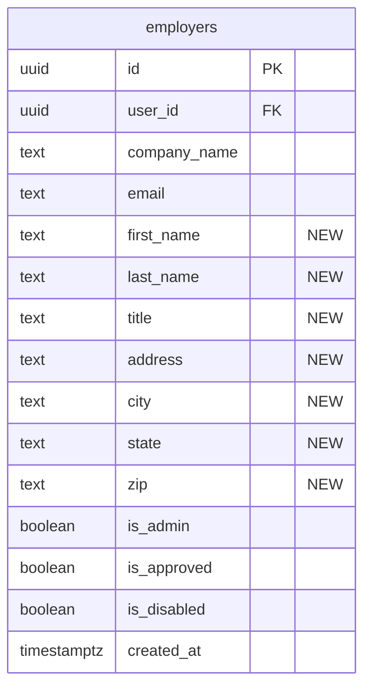

# feat: Implement Jess Feedback Round 1

## Overview

Batch of 20 improvements to the job board based on Jess Biller's first round of real-world feedback. Covers text/UI changes, new footer, expanded employer signup & profile management, delete capabilities, map clustering, job edit tag picker fix, and two new email notifications.

## Problem Statement / Motivation

Jess is actively onboarding real estate associations (Chicago NAR has 21 openings, California has 9). The feedback addresses:
- **Branding alignment**: Copy changes to position the board exclusively for RE associations
- **Missing functionality**: No way to delete applications/submissions, no profile editing, no email notifications on key events
- **Bug**: Job categories can't be edited after initial posting
- **UX**: Map markers stack invisibly when multiple jobs share a location
- **Polish**: No footer, no contact support path

## Proposed Solution

Six workstreams executed in three phases, ordered by dependency chain. DB migrations land first (Phase 1), then UI features that depend on them (Phase 2), then independent features (Phase 3).

(see brainstorm: docs/brainstorms/2026-04-06-jess-feedback-round1-brainstorm.md)

---

## Technical Approach

### Architecture

No new architectural patterns introduced. All changes extend existing patterns:
- New columns on `employers` table (same migration pattern)
- New Edge Functions (clone existing `notify-new-employer`)
- New DB triggers (clone existing `notify_new_employer` trigger)
- New Footer component (standard React component added to `App.tsx`)
- Marker clustering via `react-leaflet-cluster` (standard Leaflet plugin)

### ERD: Employer Table Changes



### Implementation Phases

---

#### Phase 1: Foundation (Migrations + Quick Changes)

All items in this phase are independent and can be parallelized.

##### 1A. DB Migration: New Employer Fields

**File:** `supabase/migrations/YYYYMMDDHHMMSS_add_employer_profile_fields.sql`

```sql
-- Add profile fields to employers table
ALTER TABLE public.employers
  ADD COLUMN IF NOT EXISTS first_name text,
  ADD COLUMN IF NOT EXISTS last_name text,
  ADD COLUMN IF NOT EXISTS title text,
  ADD COLUMN IF NOT EXISTS address text,
  ADD COLUMN IF NOT EXISTS city text,
  ADD COLUMN IF NOT EXISTS state text,
  ADD COLUMN IF NOT EXISTS zip text;

-- SECURITY DEFINER function for employer self-update (prevents privilege escalation)
-- Employers must NOT be able to set is_admin, is_approved, is_disabled on themselves
CREATE OR REPLACE FUNCTION public.update_employer_profile(
  p_first_name text DEFAULT NULL,
  p_last_name text DEFAULT NULL,
  p_title text DEFAULT NULL,
  p_company_name text DEFAULT NULL,
  p_address text DEFAULT NULL,
  p_city text DEFAULT NULL,
  p_state text DEFAULT NULL,
  p_zip text DEFAULT NULL
)
RETURNS void
LANGUAGE plpgsql
SECURITY DEFINER
SET search_path = public
AS $$
BEGIN
  UPDATE public.employers
  SET
    first_name = COALESCE(p_first_name, first_name),
    last_name = COALESCE(p_last_name, last_name),
    title = COALESCE(p_title, title),
    company_name = COALESCE(p_company_name, company_name),
    address = COALESCE(p_address, address),
    city = COALESCE(p_city, city),
    state = COALESCE(p_state, state),
    zip = COALESCE(p_zip, zip)
  WHERE user_id = auth.uid();
END;
$$;
```

**Why SECURITY DEFINER:** RLS UPDATE policies are row-level, not column-level. Without this function, an employer could potentially UPDATE `is_admin = true` on their own row. The function restricts updates to safe columns only.

##### 1B. DB Migration: Delete Policies

**File:** `supabase/migrations/YYYYMMDDHHMMSS_add_delete_policies.sql`

```sql
-- Grant DELETE on general_submissions (currently only SELECT, INSERT, UPDATE)
GRANT DELETE ON public.general_submissions TO authenticated;

-- Admin-only delete policy on general_submissions
CREATE POLICY "Admins can delete general submissions"
  ON public.general_submissions FOR DELETE
  USING (public.is_admin());

-- Storage delete policies for applications bucket
CREATE POLICY "Employers can delete own application files"
  ON storage.objects FOR DELETE
  USING (
    bucket_id = 'applications'
    AND (storage.foldername(name))[1] IN ('resumes', 'cover-letters')
    AND auth.role() = 'authenticated'
  );

CREATE POLICY "Admins can delete any application file"
  ON storage.objects FOR DELETE
  USING (
    bucket_id = 'applications'
    AND public.is_admin()
  );

-- Admin-level job_tags policies (for admin editing tags on any job)
CREATE POLICY "Admins can insert job tags"
  ON public.job_tags FOR INSERT
  WITH CHECK (public.is_admin());

CREATE POLICY "Admins can delete job tags"
  ON public.job_tags FOR DELETE
  USING (public.is_admin());
```

**Note on employer storage delete policy:** The policy above is broad (any authenticated user can delete from resumes/cover-letters folders). A tighter policy would join through `applications -> jobs -> employers` but storage policies can't easily do multi-table joins. Since the application-level RLS already restricts which applications an employer can see/delete, the code path is protected at the application layer.

##### 1C. TypeScript Types Update

**File:** `src/types/index.ts`

Update the `Employer` interface to include all current and new fields:

```typescript
export interface Employer {
  id: string;
  user_id: string;
  company_name: string;
  email: string | null;
  first_name: string | null;
  last_name: string | null;
  title: string | null;
  address: string | null;
  city: string | null;
  state: string | null;
  zip: string | null;
  is_admin: boolean;
  is_approved: boolean;
  is_disabled: boolean;
  created_at: string;
}
```

##### 1D. Quick Text/UI Changes

All independent file edits:

| Item | File | Change |
|------|------|--------|
| 1 | `src/pages/AuthPage.tsx:139` | Change label "Company Name" -> "Association Name" |
| 2 | `src/pages/AuthPage.tsx` | Add disclaimer text below email field |
| 3 | `src/pages/SubmitResumePage.tsx:119-121` | Change text + increase font size in CSS |
| 4 | `src/pages/HomePage.tsx:143` | Change `<option value="">All</option>` to `<option value="">Work Type</option>` |
| 5 | `src/pages/HomePage.tsx:108` | Replace hero-badge text |
| 7 | `src/pages/DashboardPage.tsx:238-239` | Delete "Pricing details will be announced soon..." text |

**Item 2 detail - Signup disclaimer:**
Add below the email input field:
```
Important: This platform is exclusively for real estate association professionals.
To be approved, you must register using your association-issued email address.
Personal email accounts (Gmail, Yahoo, etc.) will not be approved.
```
This is purely informational (no domain validation). Enforcement is handled by the existing admin approval flow.

**Item 3 detail - Confidentiality text:**
Change from: `"Your information is kept confidential."`
To: `"Rest assured, your information is always kept 100% Confidential."`
Increase font-size from `0.82rem` to ~`1rem` in `.submit-resume-confidential` CSS class.

---

#### Phase 2: Core Features (Depend on Phase 1 Migrations)

##### 2A. Expanded Signup Form

**Files:** `src/pages/AuthPage.tsx`, `src/context/AuthContext.tsx`

**AuthPage changes:**
- Add form fields: First Name, Last Name, Title, Address, City, State, Zip
- First Name and Last Name are **required**; Title, Address, City, State, Zip are **optional**
- Use the existing `US_STATES` constant from `src/constants.ts` for the State dropdown
- Layout: group Name fields on one row (First / Last), Title standalone, Address fields grouped

**AuthContext changes:**
- Pass all new fields through `user_metadata` in `signUp()` call (required for email confirmation flow)
- Update `ensureEmployerAndLoad()` to read new fields from `user_metadata` and include in employer INSERT
- Update the inline employer INSERT in `signUp()` (for immediate session path)
- Update `fetchEmployerInfo()` to expose new fields in state (or add a richer employer object)

**Gotcha:** Both employer creation paths (immediate session + post-email-confirmation) must include all new fields.

##### 2B. Footer Component

**New file:** `src/components/Footer.tsx`
**Modified files:** `src/App.tsx`, `src/components/Navbar.tsx`, `src/index.css`

```tsx
// Footer.tsx - simplified structure
<footer className="footer">
  <div className="footer-content">
    <span>&copy; 2026 Paramount Consulting Group. All rights reserved.</span>
    <a href="mailto:support@associationcareers.realestate">Contact Support</a>
    <span className="footer-powered-by">
      Powered by <strong>Paramount Consulting Group</strong>
    </span>
  </div>
</footer>
```

- Add `<Footer />` in `App.tsx` after `<Routes>`, before closing div
- **Remove** "Powered by Paramount" from `Navbar.tsx` (lines 26-28) - ships with footer to avoid duplication or gap
- **Exclude from MapPage:** The map uses full-viewport layout. Either conditionally hide footer on `/map` route, or use CSS to hide `.footer` when inside `.explore-page`
- Sticky footer behavior: use flexbox on body/app container so footer stays at bottom on short pages

##### 2C. Dashboard Support Link

**File:** `src/pages/DashboardPage.tsx`

Add a "Need help? Contact Support" mailto link in the dashboard header area (below company name, above stats cards). Simple `<a href="mailto:support@associationcareers.realestate">` with subtle styling.

##### 2D. Navbar Profile Dropdown

**File:** `src/components/Navbar.tsx`

Replace the current static `navbar-user` div + separate Sign Out button with a dropdown:

```tsx
<div className="navbar-profile-dropdown">
  <button className="navbar-user" onClick={toggleDropdown}>
    <span className="navbar-avatar">{companyName.charAt(0)}</span>
    <span className="navbar-company">{companyName}</span>
    <ChevronDown size={14} />
  </button>
  {dropdownOpen && (
    <div className="navbar-dropdown-menu">
      <button onClick={openProfileEdit}>Edit Profile</button>
      <button onClick={() => { signOut(); closeMenu(); }}>Sign Out</button>
    </div>
  )}
</div>
```

**Requirements:**
- Click-outside-to-close (useRef + useEffect event listener)
- Escape key closes dropdown
- Proper z-index (above page content)
- **Mobile:** On mobile (inside hamburger menu), render Edit Profile and Sign Out as inline items, not a nested dropdown

##### 2E. Profile Edit Modal

**New file:** `src/components/ProfileEditModal.tsx`
**Modified files:** `src/components/Navbar.tsx` (or `App.tsx` for modal mounting)

Modal form with fields:
- First Name, Last Name (text inputs)
- Title (text input)
- Association Name (text input, pre-filled with `company_name`)
- Address, City, State, Zip
- **Password change section** (separate from profile fields):
  - New Password + Confirm New Password
  - Only submitted if user fills these in
  - Calls `supabase.auth.updateUser({ password })` independently from profile save

**Save flow:**
1. Call `supabase.rpc('update_employer_profile', { p_first_name, ... })` for profile fields
2. If password fields filled: call `supabase.auth.updateUser({ password })` separately
3. Handle partial success: if profile saves but password fails, show specific error for password
4. On success: close modal, refresh employer data in AuthContext

**Note:** Existing employers will have NULL for all new fields. The modal handles this gracefully (empty inputs, not "null" displayed).

##### 2F. Employer Delete Applications

**File:** `src/pages/EmployerJobPage.tsx`

Add a delete button (trash icon) to each application card in the `ej-app-files` div area.

**Delete flow:**
1. Show confirmation dialog: "Delete this application? This cannot be undone."
2. Attempt storage file deletion first:
   - `supabase.storage.from('applications').remove([resumePath, coverLetterPath])`
   - Extract paths from the application's `resume_url` and `cover_letter_url`
3. Delete DB row: `supabase.from('applications').delete().eq('id', applicationId)`
4. Update local state: filter the application from `applications` array
5. Update derived state: application counts, filtered apps, stats

**Error handling:** If storage delete fails, log warning but proceed with DB deletion. Orphaned files are acceptable for MVP vs. blocking the delete.

##### 2G. Admin Delete Resume Submissions

**File:** `src/pages/AdminPage.tsx`

Add a delete button to each submission card in the Resume Submissions tab.

**Delete flow:**
1. Confirmation dialog
2. Storage delete: `supabase.storage.from('applications').remove([resumePath])` (path under `general-submissions/` prefix)
3. DB delete: `supabase.from('general_submissions').delete().eq('id', submissionId)`
4. Update `submissions` state array + badge count

##### 2H. Job Edit Tag Picker Fix

**Files:** `src/pages/EmployerJobPage.tsx`, `src/pages/AdminPage.tsx`

Both edit forms need the same fix:

1. **Load tags on mount:** Fetch all tags from `tags` table (same query as `PostJobPage.tsx`)
2. **Load current job tags on edit start:** Query `job_tags` WHERE `job_id` matches, store as `selectedTags` state
3. **Render tag picker:** Reuse the same `tag-picker` + `tag-pill` UI pattern from `PostJobPage.tsx`. Consider extracting into a shared `TagPicker` component.
4. **Save flow:**
   - Delete all existing `job_tags` for the job: `supabase.from('job_tags').delete().eq('job_id', jobId)`
   - Insert new selections: `supabase.from('job_tags').insert(selectedTags.map(...))`
   - Do this within the same `saveEdit` function, after the job update

**Shared component opportunity:** Extract `TagPicker` from `PostJobPage.tsx` into `src/components/TagPicker.tsx` so it can be reused in all three locations (create, employer edit, admin edit).

##### 2I. Admin Edit Employer Info

**File:** `src/pages/AdminPage.tsx`

In the Employers tab, add an "Edit" button on each employer card that opens an inline edit form (matching the existing inline edit pattern for jobs). Form includes: First Name, Last Name, Title, Association Name, Email, Address, City, State, Zip.

Save via direct Supabase update (admin has UPDATE RLS policy on employers already).

---

#### Phase 3: Independent Features (No Blockers)

##### 3A. Map Marker Clustering

**Files:** `src/components/MapView.tsx`, `package.json`

**Install:** `react-leaflet-cluster` (compatible with react-leaflet v5) + leaflet.markercluster CSS

**Changes to MapView.tsx:**
1. Import `MarkerClusterGroup` from `react-leaflet-cluster`
2. Import `leaflet.markercluster/dist/MarkerCluster.css` and `leaflet.markercluster/dist/MarkerCluster.Default.css`
3. Wrap the `{jobs.map(...<Marker>)}` block with `<MarkerClusterGroup>`
4. Optionally customize cluster icon to use the green brand color (`#38b653`)

**Behavior:** Default leaflet.markercluster behavior - zoom to expand on click, spiderfy at max zoom. No custom list popup needed.

**Note:** The `FlyToHandler` component continues working as-is (operates on map instance, not markers).

##### 3B. Email Notification: Employer on Application

**New files:**
- `supabase/functions/notify-employer-application/index.ts`
- `supabase/migrations/YYYYMMDDHHMMSS_application_notification_trigger.sql`

**Edge Function** (clone from `notify-new-employer`):
- Accepts `{ jobId, applicantName, applicantEmail }` in request body
- Queries `jobs JOIN employers` to get employer email and job title
- Sends HTML email: "New application for [Job Title] from [Applicant Name]"
- If employer has no email, return early (no error)
- Same SMTP config, same auth pattern (FUNCTION_SECRET from Vault)

**DB Trigger:**
```sql
CREATE OR REPLACE FUNCTION public.notify_employer_application()
RETURNS trigger
LANGUAGE plpgsql
SECURITY DEFINER
AS $$
DECLARE
  _supabase_url text;
  _function_secret text;
BEGIN
  SELECT decrypted_secret INTO _supabase_url FROM vault.decrypted_secrets WHERE name = 'supabase_url';
  SELECT decrypted_secret INTO _function_secret FROM vault.decrypted_secrets WHERE name = 'function_secret';

  PERFORM net.http_post(
    url := _supabase_url || '/functions/v1/notify-employer-application',
    headers := jsonb_build_object('Content-Type', 'application/json', 'Authorization', 'Bearer ' || _function_secret),
    body := jsonb_build_object('jobId', NEW.job_id, 'applicantName', NEW.name, 'applicantEmail', NEW.email)
  );
  RETURN NEW;
EXCEPTION WHEN OTHERS THEN
  RETURN NEW; -- Never block the INSERT
END;
$$;

CREATE TRIGGER notify_employer_on_application
  AFTER INSERT ON public.applications
  FOR EACH ROW
  EXECUTE FUNCTION public.notify_employer_application();
```

**No rate limiting for MVP.** Individual email per application. Jess can request digest later.

##### 3C. Email Notification: Admin on Resume Submission

**New files:**
- `supabase/functions/notify-admin-resume/index.ts`
- `supabase/migrations/YYYYMMDDHHMMSS_resume_notification_trigger.sql`

**Edge Function** (clone from `notify-new-employer`):
- Accepts `{ candidateName, candidateEmail }` in request body
- Reads admin notification email from `site_settings` table (same key: `approval_notification_email`)
- Sends HTML email: "New candidate resume submission from [Name]"
- Same SMTP config, same auth pattern

**DB Trigger:** Same pattern as 3B but on `general_submissions` table INSERT.

**Note:** Uses the same `approval_notification_email` from `site_settings` for all admin notifications (consistent with existing pattern).

---

## System-Wide Impact

### Interaction Graph

- **Signup** → `supabase.auth.signUp()` with expanded `user_metadata` → employer INSERT trigger → existing `notify_new_employer` Edge Function (unchanged)
- **Application submit** → `applications` INSERT → NEW trigger → `notify-employer-application` Edge Function → SMTP to employer
- **Resume submit** → `general_submissions` INSERT → NEW trigger → `notify-admin-resume` Edge Function → SMTP to admin
- **Profile edit** → `update_employer_profile()` RPC (SECURITY DEFINER) → employers UPDATE (no cascading effects)
- **Delete application** → storage.remove() → applications DELETE (RLS checks employer ownership via job)
- **Delete submission** → storage.remove() → general_submissions DELETE (RLS checks is_admin)

### Error Propagation

- **Edge Function failures** are fire-and-forget (wrapped in EXCEPTION WHEN OTHERS). Never block INSERT operations.
- **Storage delete failures** are caught in frontend. Log warning, proceed with DB delete. Orphaned files acceptable for MVP.
- **Profile save + password change** are independent operations. Partial success is communicated to user.

### State Lifecycle Risks

- **Orphaned storage files** on application/submission delete if storage call fails. Mitigation: attempt storage first, continue regardless.
- **Existing employers with NULL new fields.** Mitigation: all new columns are nullable, UI shows empty inputs not "null".
- **Job tags on edit save** uses delete-all-then-insert pattern. If insert fails after delete, job loses all tags. Mitigation: could wrap in a transaction via RPC, but for MVP the risk is low.

---

## Acceptance Criteria

### Workstream 1: Quick Text/UI Changes
- [ ] Signup form label says "Association Name" (not "Company Name")
- [ ] Association-email disclaimer text visible on signup form
- [ ] Become a Candidate page shows "Rest assured, your information is always kept 100% Confidential." in larger font
- [ ] Homepage search dropdown default reads "Work Type" (not "All")
- [ ] Homepage hero badge reads "The Only Job Board Built Exclusively for Real Estate Associations"
- [ ] Homepage hero subtitle still shows dynamic job count number
- [ ] Billing tab no longer shows "Pricing details will be announced soon..." text

### Workstream 2: Footer + Support
- [ ] Footer appears on all pages except MapPage with copyright, Paramount branding, and support mailto link
- [ ] "Powered by Paramount" removed from navbar
- [ ] Footer stays at bottom of viewport on short-content pages
- [ ] Dashboard has "Contact Support" mailto link

### Workstream 3: Employer Signup & Profile
- [ ] Signup form collects First Name (required), Last Name (required), Title, Address, City, State, Zip
- [ ] All new fields stored in employers table and survive email confirmation flow
- [ ] Navbar shows clickable dropdown with "Edit Profile" and "Sign Out"
- [ ] Dropdown closes on click-outside and Escape key
- [ ] Profile edit modal allows updating all employer fields
- [ ] Password change works independently from profile field updates
- [ ] Admin can edit employer contact info from admin panel

### Workstream 4: Delete + Tag Fix
- [ ] Employer can delete individual application submissions (with confirmation)
- [ ] Admin can delete general resume submissions (with confirmation)
- [ ] Storage files cleaned up on delete (best-effort)
- [ ] Job edit form (employer + admin) includes tag/category picker
- [ ] Tag picker pre-selects current tags, changes persist on save

### Workstream 5: Map Clustering
- [ ] Co-located jobs show as numbered clusters on the map
- [ ] Clicking a cluster zooms in to reveal individual markers
- [ ] Cluster styling uses brand green color

### Workstream 6: Email Notifications
- [ ] Employer receives email when someone applies to their job
- [ ] Admin receives email when someone submits a resume via Become a Candidate
- [ ] Email failures never block the user's submit action

---

## Dependencies & Risks

### Dependencies (Implementation Order)
1. **Phase 1 migrations** must be applied before Phase 2 features
2. Footer + navbar branding removal must ship together
3. Profile edit modal depends on navbar dropdown + migration
4. Tag picker fix for admin depends on admin-level `job_tags` RLS policies

### Risks
| Risk | Likelihood | Impact | Mitigation |
|------|-----------|--------|------------|
| `react-leaflet-cluster` incompatible with react-leaflet v5 | Medium | Blocks map clustering | Test compatibility early; fallback to `leaflet.markercluster` directly |
| 10-field signup reduces conversion | Medium | Business impact | Only First/Last Name required; rest optional and completable later via profile |
| Edge Function SMTP failures | Low | Missed notifications | Fire-and-forget pattern, same as existing working notification |
| Storage orphan files | Low | Wasted storage | Acceptable for MVP; can add cleanup job later |

---

## Sources & References

### Origin
- **Brainstorm document:** [docs/brainstorms/2026-04-06-jess-feedback-round1-brainstorm.md](docs/brainstorms/2026-04-06-jess-feedback-round1-brainstorm.md) — Key decisions: marker clustering for map, separate Edge Functions per notification, navbar dropdown for profile, new columns on employers table, mailto for support

### Internal References
- Existing Edge Function template: `supabase/functions/notify-new-employer/index.ts`
- DB trigger pattern: `supabase/migrations/20260328000006_employer_insert_trigger.sql`
- Tag picker UI: `src/pages/PostJobPage.tsx:184-202`
- RLS helper: `public.is_admin()` in `supabase/migrations/20260324000000_fix_employer_rls_recursion.sql`
- Employer signup flow: `src/context/AuthContext.tsx:121-145`
- Storage policies reference: `supabase/migrations/20260328000005_security_hardening.sql`

### Files Affected
| File | Items |
|------|-------|
| `src/pages/AuthPage.tsx` | 1, 2, 10 |
| `src/pages/HomePage.tsx` | 4, 5 |
| `src/pages/DashboardPage.tsx` | 7, 9 |
| `src/pages/SubmitResumePage.tsx` | 3 |
| `src/pages/EmployerJobPage.tsx` | 15, 17 |
| `src/pages/AdminPage.tsx` | 14, 16, 17 |
| `src/pages/PostJobPage.tsx` | 17 (extract TagPicker) |
| `src/components/Navbar.tsx` | 8, 12 |
| `src/components/MapView.tsx` | 18 |
| `src/components/Footer.tsx` | 8 (NEW) |
| `src/components/ProfileEditModal.tsx` | 13 (NEW) |
| `src/components/TagPicker.tsx` | 17 (NEW, extracted) |
| `src/context/AuthContext.tsx` | 10, 13 |
| `src/types/index.ts` | 11 |
| `src/App.tsx` | 8 |
| `src/index.css` | 3, 8, 12, 13 |
| `supabase/functions/notify-employer-application/index.ts` | 19 (NEW) |
| `supabase/functions/notify-admin-resume/index.ts` | 20 (NEW) |
| `supabase/migrations/` | 11, 15, 16, 17, 19, 20 (NEW migrations) |
