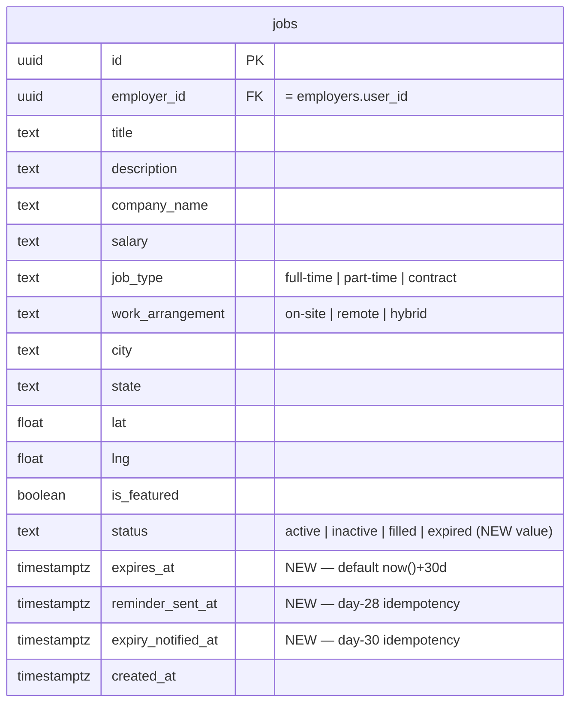

# feat: Post-Launch Retainer Batch

## Overview

Six items from the **Jun 17, 2026** call with Jess Biller, the first work under the new ~$200/mo retainer, bundled into one plan but phased so the quick wins ship independently of the larger expiration feature:

1. Keyword search also matches **tags/categories + description** (not just title).
2. Map **state search** zooms to the whole state instead of a random city.
3. Map markers show **overlapping jobs together** and open popups on **hover** (tap on mobile).
4. **30-day job expiration** with reminder/expiry emails to employer + admin and dashboard renewal (the main feature).
5. **Google Analytics 4** with SPA route tracking.
6. **SEO**: `JobPosting` structured data + a dynamic sitemap (Phase A; prerender/410/Indexing API deferred to Phase B).

(see brainstorm: `docs/brainstorms/2026-06-18-post-launch-retainer-batch-brainstorm.md`, design: `docs/designs/2026-06-18-retainer-batch-design.md`)

## Problem Statement / Motivation

The board is launching: Paramount will scrape association job ads nationwide, create free pre-built accounts, and use the board as a lead source for recruiting/assessment services. This batch fixes real usability gaps Jess hit while testing (search misses tagged jobs, state search over-zooms, markers lost the multi-job view she liked) and adds the expiration system that (a) keeps listings fresh and (b) doubles as a lead signal — a job unfilled at 30 days flags an association that may need recruiting help.

---

## Data Design Decisions

- **`jobs.status` stays a DB CHECK-constraint enum, not a lookup table.** Adding `'expired'` to the existing `active|inactive|filled` constraint. Values are stable, code-coupled (filters, badge styles, JSON-LD gating); a runtime-editable table adds no value. (Matches the existing pattern from `20260328000000_split_job_type_arrangement.sql`.)
- **Idempotency via timestamp columns**, not a separate queue: `reminder_sent_at` and `expiry_notified_at` on `jobs`; their `IS NULL` state is the "not yet sent" flag, stamped in the same `UPDATE…RETURNING` statement that claims the batch (claim-then-send).
- **"Publicly active" = `status='active'`.** The daily cron keeps `status` fresh (flips past-expiry actives to `expired`), so `status='active'` remains the single public gate used by lists, the detail page, the sitemap, and JSON-LD. `expires_at > now()` is an optional belt-and-suspenders check for the <24h window between expiry and the next cron run. **Recommended consolidation:** a `public_jobs` view (or a shared helper) so this rule lives in one place — currently the rule is duplicated across HomePage, MapPage, (missing on) JobDetailPage, and the new sitemap.

---

## ERD: jobs table changes



---

## Implementation Phases

Each phase is an independently shippable vertical slice with its own test checkpoint. **Phase 1 ships first** (Jordan's Gatlinburg trip — pure frontend, no migrations). Phases 2–4 follow.

---

### Phase 1 — Quick Wins (frontend-only, no DB changes)

#### 1A. Keyword search across tags + description

**Files:** `src/pages/MapPage.tsx`, `src/pages/HomePage.tsx`, `src/types/index.ts`

- **MapPage** — change the jobs query select from `job_tags(tag_id)` to `job_tags(tag_id, tags(name))` and add `description` to the column list (currently absent). Update the local `Job`/`JobTag` interfaces (`MapPage.tsx:11-13`).
- Update both keyword predicates so the match is an **OR over `title + company_name + description + tag names`**, identical on both pages:
  ```ts
  const q = keyword.toLowerCase();
  const matchesKeyword =
    !q ||
    job.title.toLowerCase().includes(q) ||
    job.company_name.toLowerCase().includes(q) ||
    (job.description ?? '').toLowerCase().includes(q) ||
    (job.job_tags ?? []).some(jt => jt.tags?.name?.toLowerCase().includes(q));
  ```
- **Tagless jobs must still match** the other three fields — guard `job_tags` with `?? []` (do not let an empty tag list exclude a row).
- Keep naive substring matching for MVP (document: "marketing director" won't match "Director of Marketing" — acceptable; revisit token-split later).

**Test checkpoint:** typing `CEO` and `Finance` on both HomePage and MapPage returns jobs tagged (but not titled) CEO/Finance; a job with no tags still matches by title/description.

#### 1B. Map state-level zoom via boundingbox

**Files:** `src/components/LocationAutocomplete.tsx`, `src/pages/MapPage.tsx`, `src/components/MapView.tsx`, `src/utils/distance.ts`

- **LocationAutocomplete**: extend the `Suggestion` type to keep Nominatim's `boundingbox` (`[south, north, west, east]` strings) and widen `onSelect` to `(lat, lng, label, bbox?)`.
- **MapPage**: thread `bbox` through `handleLocationSelect`; also capture `boundingbox` in the `?location=` URL geocode path (`MapPage.tsx:96-112`), which currently hardcodes zoom 10.
- **MapView**: add a `bounds` prop and a `flyToBounds` path in `FlyToHandler`. When `bounds` is present and all four numbers are finite (reuse the `toCoord` NaN-guard), call `map.flyToBounds(bounds, { maxZoom: 13, padding: [40,40] })`; else fall back to `flyTo(center, zoom)`.
- **Precedence (explicit):** if `radius > 0` → `radiusToZoom(radius)` centered on the point; else if a `bbox` exists → `fitBounds`; else default US view. Clearing the radius re-fits the bbox.

**Test checkpoint:** searching "California" / "Texas" frames the whole state; "Columbus, OH" stays city-level; selecting a radius still zooms to the radius; a single-address bbox doesn't over-zoom past 13.

#### 1C. Marker hover popups + grouped overlapping jobs

**Files:** `src/components/MapView.tsx`, `src/pages/MapPage.tsx` (pass `isMobile`), `src/index.css`

- **Replace** the click-to-spread machinery (`ExpansionController`, `spreadOffsets`, `expandedKey`, fly-to-zoom-15) with a single grouped popup.
- Keep the co-location grouping (5-decimal `toFixed` bucket). A group of 1 → a normal pin; a group of >1 → one badge marker whose popup **lists all jobs at that point**, each a `<Link to={/jobs/:id}>`.
- **Hover (desktop) / tap (mobile):** pass an `isMobile` flag (reuse the `matchMedia` already in MapPage). On non-touch, bind `mouseover`→open popup, and prevent flicker so in-popup links are clickable: do **not** close on marker `mouseout`; instead bind mouseenter/mouseleave on the popup with a short close-delay timeout. On touch, bind tap/click only. **Always retain click-to-open as a fallback** (also covers keyboard/accessibility).
- **Cap the list:** show first ~8 jobs + "View all N at this location"; popup body `max-height` + `overflow-y:auto` (associations cluster many jobs at one city point).

**Test checkpoint:** desktop hover over a single pin and a multi-job badge opens the popup/list and its links are clickable without flicker; mobile tap opens it; a 20-job point shows a capped scrollable list.

---

### Phase 2 — 30-Day Job Expiration System (DB + cron + edge function + UI)

#### 2A. Migration: schema + backfill

**File:** `supabase/migrations/<ts>_add_job_expiration.sql`

```sql
-- 1. Columns
ALTER TABLE public.jobs
  ADD COLUMN IF NOT EXISTS expires_at         timestamptz NOT NULL DEFAULT (now() + interval '30 days'),
  ADD COLUMN IF NOT EXISTS reminder_sent_at   timestamptz,
  ADD COLUMN IF NOT EXISTS expiry_notified_at timestamptz;

-- 2. Add 'expired' to the status enum (drop + recreate check constraint)
ALTER TABLE public.jobs DROP CONSTRAINT IF EXISTS jobs_status_check;
ALTER TABLE public.jobs ADD CONSTRAINT jobs_status_check
  CHECK (status IN ('active','inactive','filled','expired'));

-- 3. Backfill existing rows: expires_at = created_at + 30d
UPDATE public.jobs SET expires_at = created_at + interval '30 days';

-- 4. First-run email suppression: any already-past active job is expired NOW,
--    with notify flags pre-stamped so the first cron run sends NO email.
UPDATE public.jobs
   SET status = 'expired',
       reminder_sent_at = now(),
       expiry_notified_at = now()
 WHERE status = 'active' AND expires_at <= now();

-- 5. Partial indexes for the daily scan
CREATE INDEX IF NOT EXISTS jobs_reminder_due_idx
  ON public.jobs (expires_at) WHERE status = 'active' AND reminder_sent_at IS NULL;
CREATE INDEX IF NOT EXISTS jobs_expiry_pending_idx
  ON public.jobs (expires_at) WHERE expiry_notified_at IS NULL;
```

#### 2B. Migration: renew RPC

**File:** `supabase/migrations/<ts>_add_renew_job_rpc.sql`

`SECURITY DEFINER` RPC scoped by ownership (mirrors `update_employer_profile`). **Renew is for expired jobs and resets the lifecycle:**

```sql
CREATE OR REPLACE FUNCTION public.renew_job(p_job_id uuid)
RETURNS public.jobs
LANGUAGE plpgsql SECURITY DEFINER SET search_path = public
AS $$
DECLARE r public.jobs;
BEGIN
  UPDATE public.jobs
     SET status = 'active',
         expires_at = now() + interval '30 days',
         reminder_sent_at = NULL,
         expiry_notified_at = NULL
   WHERE id = p_job_id
     AND employer_id = auth.uid()   -- ownership check
   RETURNING * INTO r;
  IF r.id IS NULL THEN RAISE EXCEPTION 'job not found or not owned'; END IF;
  RETURN r;
END; $$;
```

> **Reactivation safety (SpecFlow P1):** any transition *into* `active` for a past-expiry job must reset `expires_at`, or the cron re-expires it within 24h. Renew handles the expired case. For the existing status `<select>` (inactive/filled → active), the `updateJobStatus` path must also bump `expires_at = now()+30d` when the job's `expires_at <= now()` — route it through `renew_job` or a small `reactivate` update.

#### 2C. Edge Function: `job-lifecycle-emails`

**File:** `supabase/functions/job-lifecycle-emails/index.ts` (clone `notify-employer-application`)

- Auth: `Authorization: Bearer ${FUNCTION_SECRET}` (match existing functions — do **not** introduce `x-function-secret`).
- Body: `{ reminders: [{job_id,employer_id,title,expires_at}], expiries: [{job_id,employer_id,title}] }`.
- **Open ONE SMTP connection per invocation**, loop recipients, isolate per-recipient errors (one bad address must not abort the batch).
- **Decouple recipients (SpecFlow P0):** for each item, send the employer email **and** the admin email independently. A missing `employer.email` must **not** suppress the admin lead email (do not copy the `notify-employer-application` early-return).
- Admin address from `site_settings.approval_notification_email`; if unset, log a warning (and consider `SMTP_FROM` fallback). Surface "notification email not set" in AdminPage (2E).
- Email content (branded green template, `escapeHtml`):
  - **Day-28 reminder → employer:** "Your posting '<title>' expires in 2 days — log in to renew." **→ admin:** heads-up copy.
  - **Day-30 expired → employer:** "'<title>' has expired and been removed; renew anytime." **→ admin:** "Expired unfilled — reach out (recruiting lead)."

#### 2D. Migration: pg_cron schedule + maintenance function

**File:** `supabase/migrations/<ts>_schedule_job_lifecycle_cron.sql`

```sql
CREATE EXTENSION IF NOT EXISTS pg_cron WITH SCHEMA pg_catalog;

CREATE OR REPLACE FUNCTION public.run_daily_job_maintenance()
RETURNS void LANGUAGE plpgsql SECURITY DEFINER SET search_path = public
AS $$
DECLARE
  v_url text; v_secret text; v_reminders jsonb; v_expiries jsonb;
BEGIN
  -- advisory lock so two runs never overlap
  IF NOT pg_try_advisory_lock(hashtext('run_daily_job_maintenance')) THEN RETURN; END IF;

  SELECT decrypted_secret INTO v_url    FROM vault.decrypted_secrets WHERE name='supabase_url';
  SELECT decrypted_secret INTO v_secret FROM vault.decrypted_secrets WHERE name='function_secret';

  -- (a) flip ONLY active past-expiry jobs (never touch inactive/filled)
  UPDATE public.jobs SET status='expired'
   WHERE status='active' AND expires_at <= now();

  -- (b1) claim day-28 reminders (active, expiring within 2 days, not reminded)
  WITH due AS (
    SELECT id, employer_id, title, expires_at FROM public.jobs
     WHERE status='active' AND reminder_sent_at IS NULL
       AND expires_at > now() AND expires_at <= now() + interval '2 days'
  ), marked AS (
    UPDATE public.jobs j SET reminder_sent_at=now() FROM due
     WHERE j.id=due.id RETURNING due.id, due.employer_id, due.title, due.expires_at
  ) SELECT jsonb_agg(to_jsonb(marked)) INTO v_reminders FROM marked;

  -- (b2) claim day-30 expiry notices (expired, not yet notified)
  WITH due AS (
    SELECT id, employer_id, title FROM public.jobs
     WHERE status='expired' AND expiry_notified_at IS NULL AND expires_at <= now()
  ), marked AS (
    UPDATE public.jobs j SET expiry_notified_at=now() FROM due
     WHERE j.id=due.id RETURNING due.id, due.employer_id, due.title
  ) SELECT jsonb_agg(to_jsonb(marked)) INTO v_expiries FROM marked;

  IF v_url IS NULL OR v_secret IS NULL THEN RETURN; END IF;
  IF COALESCE(jsonb_array_length(v_reminders),0)=0
     AND COALESCE(jsonb_array_length(v_expiries),0)=0 THEN RETURN; END IF;

  PERFORM net.http_post(
    url := v_url || '/functions/v1/job-lifecycle-emails',
    headers := jsonb_build_object('Content-Type','application/json',
                                  'Authorization','Bearer ' || v_secret),
    body := jsonb_build_object('reminders', COALESCE(v_reminders,'[]'::jsonb),
                               'expiries',  COALESCE(v_expiries,'[]'::jsonb)));
END; $$;

-- idempotent schedule (named cron.schedule is an upsert since pg_cron 1.3)
SELECT cron.schedule('daily-job-maintenance', '0 13 * * *',
                     $$ SELECT public.run_daily_job_maintenance(); $$);
```

> Daily at **13:00 UTC** (~9am ET; DST drift acceptable for lifecycle email). Claim-then-send guarantees exactly-once (accepts rare email-loss over duplicate-send). Cron touches **only `status='active'`**.

#### 2E. Dashboard + employer UI

**Files:** `src/pages/DashboardPage.tsx`, `src/pages/EmployerJobPage.tsx`, `src/pages/AdminPage.tsx`, `src/types/index.ts`, `src/index.css`

- Add `expires_at` (+ `expired` to `STATUS_STYLES`) to the dashboard job query/interface; show **"Expires in N days"** for active jobs and an **Expired** badge otherwise.
- **`expired` is a read-only badge, NOT a `<select>` option** (SpecFlow P0). When `status==='expired'`, hide the status `<select>` and show a **"Renew (30 days)"** button → `supabase.rpc('renew_job', { p_job_id })`; on success use the **returned row** to update local state (don't leave a stale "Expired" row).
- The active/inactive/filled `<select>` stays for non-expired jobs; reactivating a past-expiry inactive/filled job must reset `expires_at` (route through renew/reactivate — see 2B).
- **AdminPage:** surface admin notification email status ("not set" warning); disable/badge the Feature toggle for non-active jobs (a featured expired job never shows).

#### 2F. Public exposure gating (SpecFlow P0 — applies site-wide)

**Files:** `src/pages/JobDetailPage.tsx`, `src/pages/ApplyPage.tsx`, migration (INSERT guard)

- `JobDetailPage` currently `.single()` with no status check and renders Apply for any status. Branch on `status !== 'active'` → render a **"This position is no longer accepting applications"** state, hide the Apply CTA (keep page for back-links/SEO, no JobPosting JSON-LD — see 4A).
- `ApplyPage`: block submission when `status !== 'active'`.
- **DB guard:** add an `applications` INSERT policy/trigger requiring the target job be `status='active'` (don't rely on UI alone).

**Test checkpoint (Phase 2):** set a test job's `expires_at` to the past; run `SELECT run_daily_job_maintenance();` → status flips to `expired`, one batched POST fires, employer + admin each receive the correct email; re-running sends **no** duplicate; `/jobs/:id` for the expired job shows the closed state and blocks Apply; Renew resets it to active with a fresh 30-day clock; backfilled old jobs expired silently with no email.

---

### Phase 3 — Google Analytics 4

**Files:** `index.html`, `src/App.tsx` (or root layout), new `src/hooks/usePageTracking.ts`, `.env`/`VITE_GA_ID`

- `index.html`: gtag snippet with `gtag('config', VITE_GA_ID, { send_page_view: false })` to avoid double-counting.
- `usePageTracking` hook: `useLocation()` → `useEffect` fires `gtag('event','page_view',{ page_location, page_path: pathname+search, page_title })`. Mount once in a component **under** the router. Guard React StrictMode double-fire in dev.
- Measurement ID behind `VITE_GA_ID` (pending from Jess — analytics is inert until set). Consider grouping `/jobs/:id` to avoid high-cardinality UUID page paths.

**Test checkpoint:** GA4 Realtime shows one `page_view` per client-side navigation; no double counts.

---

### Phase 4 — SEO: JobPosting structured data + dynamic sitemap (Phase A)

**Files:** `src/pages/JobDetailPage.tsx`, new `supabase/functions/sitemap/index.ts`, `public/robots.txt`, add `react-helmet-async`, site-origin constant

- **JobPosting JSON-LD** on `/jobs/:id`, injected via `react-helmet-async`, **only when `status==='active'`** (SpecFlow P0 — currently emitted unconditionally with no `validThrough`, a manual-action risk). Fields: `title`, `description` (HTML), `datePosted=created_at`, **`validThrough=new Date(expires_at).toISOString()`**, `hiringOrganization` (`company_name`, logo when available), `jobLocation` (city/state/US) — or `jobLocationType:"TELECOMMUTE"` + `applicantLocationRequirements:{Country:"USA"}` for remote — `employmentType` (map `job_type`→`FULL_TIME|PART_TIME|CONTRACTOR`), `baseSalary` when parseable, `identifier`.
- **Dynamic sitemap** Edge Function: queries `status='active' AND expires_at > now()`, emits `<urlset>` with real `lastmod` (job `updated_at`/`created_at`), `Content-Type: application/xml`, `Cache-Control: max-age=3600`. Point `robots.txt` at it (and ideally a clean `/sitemap.xml` rewrite).
- **Site origin** behind one constant/env (domain pending — `associationcareers.com` vs `.realestate`) so canonical/JSON-LD `url`/sitemap `loc` flip in one place.
- **Phase B (flagged, NOT in this plan):** crawler-facing prerender + real `410` for dead jobs + Google Indexing API. Set expectation with Jess that reliable Google-for-Jobs inclusion + proper removal eventually needs a small edge layer — and SEO ranking is a 3–6 month organic effort.

**Test checkpoint:** Rich Results Test passes on an active job and shows **no** JobPosting markup on an expired job; the sitemap function returns only active+unexpired jobs.

---

## System-Wide Impact

- **New public gate**: `status='active'` now also governs JobDetailPage, ApplyPage, sitemap, and JSON-LD — previously only list pages. Consolidate via a `public_jobs` view if convenient.
- **New scheduled path**: pg_cron → `run_daily_job_maintenance()` → `net.http_post` → `job-lifecycle-emails` → SMTP. First scheduling mechanism in the project (all prior email was AFTER INSERT triggers).
- **Email volume**: day-28 + day-30 batches across up to ~1200 associations — one SMTP connection per cron run, per-recipient error isolation.

## Acceptance Criteria

**Search/Map (Phase 1)** — ✅ implemented (manual verification pending)
- [x] Keyword matches title + company + description + tag names on **both** HomePage and MapPage; MapPage query fetches `tags(name)` + `description`; tagless jobs still match other fields.
- [x] State search frames the whole state via boundingbox; city stays city-level; radius overrides; bbox clamped to `maxZoom 13`.
- [x] Markers open popups on hover (desktop) / tap (mobile); co-located jobs show one capped, scrollable, link-clickable popup with no flicker; click fallback retained.

**Expiration (Phase 2)**
- [ ] New jobs default `expires_at = now()+30d`; existing backfilled to `created_at+30d`; already-past jobs expired silently (no first-run email).
- [ ] Daily cron flips **only `status='active'`** past-expiry jobs to `expired`; never touches inactive/filled; advisory-locked; idempotent (claim-then-send) — re-run sends no duplicates.
- [ ] Day-28 reminder + day-30 expiry emails reach **employer and admin independently**; missing employer email does not suppress the admin lead email; unset admin email is logged + surfaced in AdminPage.
- [ ] `expired` is a read-only badge (never a `<select>` option); Renew RPC (ownership-checked) resets status/`expires_at`/flags and updates local state from the returned row; reactivating a past-expiry inactive/filled job also resets `expires_at`.
- [ ] Expired job `/jobs/:id` shows "no longer accepting applications", hides Apply; applications blocked in UI **and** DB.

**Analytics & SEO (Phases 3–4)**
- [ ] GA4 fires one `page_view` per route change (no double count); behind `VITE_GA_ID`.
- [ ] JobPosting JSON-LD only on active jobs, always includes ISO `validThrough`; remote jobs use `TELECOMMUTE` + `applicantLocationRequirements`.
- [ ] Sitemap edge function returns only active+unexpired jobs with real `lastmod`; robots.txt points to it.

## Dependencies & Risks

| Risk | Likelihood | Impact | Mitigation |
|---|---|---|---|
| First cron run email blast on legacy data | Med | High (spams Jess/employers) | Backfill pre-stamps notify flags + expires already-past jobs silently (2A) |
| Duplicate emails from cron overlap/retry | Med | Med | Advisory lock + claim-then-send `UPDATE…RETURNING` (2D) |
| Expired jobs still applyable | High (current bug) | High | JobDetailPage/ApplyPage gating + DB INSERT guard (2F) |
| Status `<select>` clobbers `expired` | High | High (silent destructive write + cron re-expire loop) | `expired` as read-only badge; reactivation resets `expires_at` (2B/2E) |
| Google manual action on stale JobPosting markup | Med | High (SEO penalty) | JSON-LD gated to active + `validThrough` (4A) |
| Leaflet hover popup flicker breaks in-popup links | Med | Med | Keep popup open on marker mouseout; popup-hover close-delay (1C) |
| Domain / GA ID unconfirmed | High | Low | Parameterize site origin + `VITE_GA_ID`; non-blocking |
| pg_cron not enabled on the instance | Low | Med | `CREATE EXTENSION IF NOT EXISTS pg_cron` in migration; verify in Supabase dashboard |

## Sources & References

### Origin
- **Brainstorm:** `docs/brainstorms/2026-06-18-post-launch-retainer-batch-brainstorm.md` — decisions: expire=status flip (not delete), renewal via dashboard login, admin gets day-28 + day-30 lead alerts, pg_cron scheduler, bundled scope, backfill from `created_at`, dynamic sitemap, SEO Phase A first, mobile tap fallback.
- **Design:** `docs/designs/2026-06-18-retainer-batch-design.md`

### Internal patterns (reuse)
- Email edge fn: `supabase/functions/notify-employer-application/index.ts` (Bearer-secret auth, branded HTML, `escapeHtml`, employer lookup `employers.user_id = jobs.employer_id`) — **but decouple recipients; do not copy its no-email early-return.**
- Trigger/vault pattern: `supabase/migrations/20260423000000_harden_notification_triggers.sql`
- SECURITY DEFINER self-service RPC: `update_employer_profile` (`20260406…` round-1 plan / migration)
- Status enum constraint change: `supabase/migrations/20260328000000_split_job_type_arrangement.sql`
- Admin email key `approval_notification_email`: `supabase/migrations/20260328000002_add_site_settings.sql`
- jobs SELECT RLS `using(true)`: `supabase/migrations/20260309000001_enable_rls.sql`
- Prior plans: `docs/plans/2026-04-06-001-feat-jess-feedback-round1-plan.md` (note: `react-leaflet-cluster` was added then dropped in commit `f483f06` — clustering not used), `docs/plans/2026-03-28-001-feat-search-filter-restructure-plan.md`

### External research (2026)
- Supabase Cron / pg_cron: https://supabase.com/docs/guides/cron · install: https://supabase.com/docs/guides/cron/install · pg_net: https://supabase.com/docs/guides/database/extensions/pg_net (async, returns request id, fires after commit)
- Named `cron.schedule` is an UPSERT since pg_cron 1.3: https://www.citusdata.com/blog/2020/10/31/evolving-pg-cron-together/
- Google JobPosting structured data + expiry/takedown (404/410, remove markup, or past `validThrough`; manual-action risk): https://developers.google.com/search/docs/appearance/structured-data/job-posting
- Build a sitemap (50k URL / 50MB limits; `lastmod` discipline): https://developers.google.com/search/docs/crawling-indexing/sitemaps/build-sitemap
- Dynamic Supabase sitemaps: https://docs.hadoseo.com/guides/dynamic-sitemap-supabase
- GA4 SPA measurement (`send_page_view:false` + manual page_view): https://developers.google.com/analytics/devguides/collection/ga4/single-page-applications

### Files affected (summary)
| Area | Files |
|---|---|
| Search | `src/pages/MapPage.tsx`, `src/pages/HomePage.tsx`, `src/types/index.ts` |
| Map zoom/markers | `src/components/MapView.tsx`, `src/components/LocationAutocomplete.tsx`, `src/pages/MapPage.tsx`, `src/utils/distance.ts`, `src/index.css` |
| Expiration | `supabase/migrations/<ts>_add_job_expiration.sql`, `<ts>_add_renew_job_rpc.sql`, `<ts>_schedule_job_lifecycle_cron.sql`, `supabase/functions/job-lifecycle-emails/index.ts`, `src/pages/DashboardPage.tsx`, `src/pages/EmployerJobPage.tsx`, `src/pages/AdminPage.tsx`, `src/pages/JobDetailPage.tsx`, `src/pages/ApplyPage.tsx`, `src/types/index.ts`, `src/index.css` |
| GA4 | `index.html`, `src/App.tsx`, `src/hooks/usePageTracking.ts` |
| SEO | `src/pages/JobDetailPage.tsx`, `supabase/functions/sitemap/index.ts`, `public/robots.txt`, site-origin constant |
